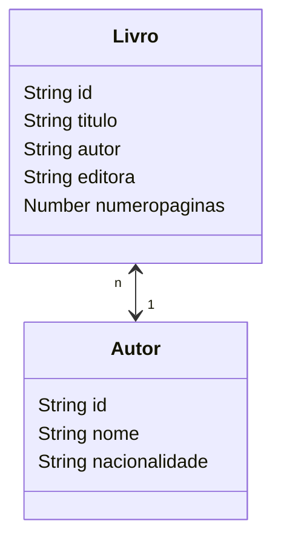
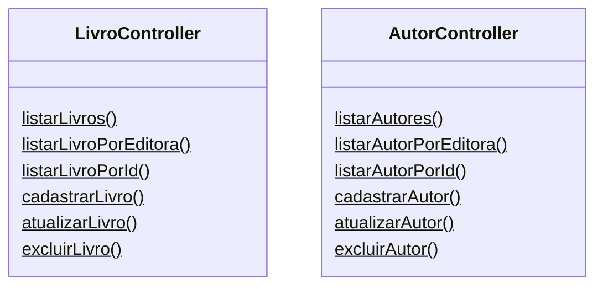

# Livraria de Dados

## Descrição:
Foi desenvolvida uma API Rest com conexão ao [MongoDB](https://www.alura.com.br/artigos/mongodb-o-banco-baseado-em-documentos) na nuvem, onde temos as funcionalidades de um CRUD completo. 

## Construção do projeto:

Iniciei o projeto realizando testes de consultas, alterações e exclusões de dados de um array. Em seguida, avancei criando meu banco na nuvem através de uma conta no [Atlas](https://www.mongodb.com/atlas/database).

Feito isso, separei as responsabilidades do projeto utilizando o padrão MVC com importação de módulos utilizando o [ES6](https://www.w3schools.com/js/js_es6.asp). 
Com isso, segui com as configurações de conexão ao banco de dados e inserção dos métodos criados nas rotas.

### Schemas:

### Classes:

Para os testes, utilizei o [Postman](https://www.postman.com/) que facilitou bastante nesse caminhada.

## Próximos passos:

- [ ] Criar um Schema para editora
- [ ] Listar livros por autor utilizando parâmetros
- [ ] ...
